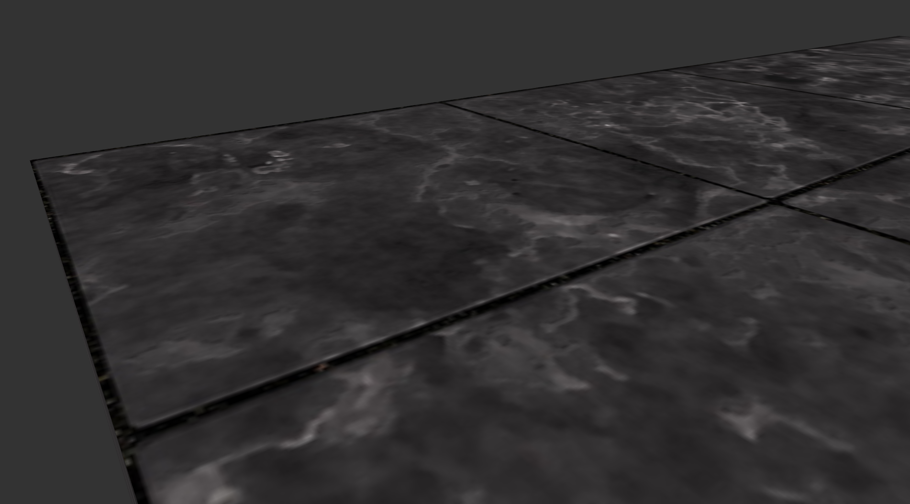

# Learn-OpenGL
To learn OpenGL and Computer Graphics
## Part1 Start
- GLAD, Shader, Transform and Camera
- Sample

## Part2 Light
- Mat, Tex and Lightings
- Sample

## Part3 Model
- Assimp and Mesh Class
- Sample

## Part4 Advanced OGL
- Depth/Stencil Testing
- Framebuffer, Cubemap, MSAA and etc..
- Sample

## Part5 Advanced Lighting
- Gamma Correction and HDR
- Shadow, Normal and Parallax Mapping
- Deferred shading and SSAO
- Sample

## Part6 PBR
- Lighting and IBL
- Sample
